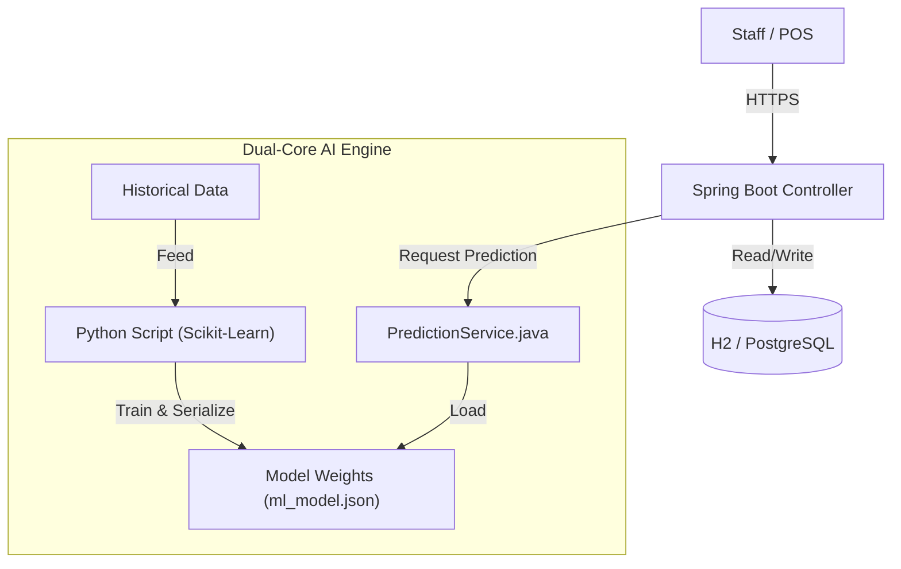

# The Baker: AI-Driven Inventory Optimization System
> **A full-stack retail management platform featuring a "Dual-Core" predictive engine to minimize food waste while maximizing sales potential.**

## Architecture Overview
The application follows a Hybrid Monolith architecture designed for reliability and ease of deployment. It leverages Java Spring Boot for robust transaction handling and Python for statistical modeling, bridging the two via a lightweight local interface.

**Tech Stack**
Backend: Java 17, Spring Boot 3.2 (Web, JPA, Thymeleaf)  
Data Science: Python 3.x, Pandas, Scikit-Learn (Linear Regression)  
Database: H2 (Dev) / PostgreSQL (Prod)  
Frontend: Server-Side Rendering (Thymeleaf) + TailwindCSS  
DevOps: GitHub Actions (CI) -> Render (CD)  

## The "Dual-Core" Prediction Logic
Retail inventory management faces two conflicting challenges: Demand Volatility (Weather/Day effects) and Data Sparsity (Waste events are rare but costly). To solve this, The Baker employs a hybrid strategy that decouples demand forecasting from risk assessment.  

**Core 1: The Demand Model (Dynamic Regression)**  
**Objective**: Predict Sales Velocity ("How many can we sell?").  
**Algorithm**: Multivariate Linear Regression ( $$y = \beta_0 + \beta_1x_1 + ... + \beta_nx_n$$ )  
**Feature Engineering:**  
**Day of Week**: One-hot encoded vectors to capture weekly seasonality (e.g., Saturday_Boost).  
**Weather**: Categorical mapping (Sunny, Rain, Snow) to impact coefficients.  
**Temperature**: Continuous variable to model heat/cold sensitivity.  
**Logic**: The model calculates a Base Bias (Standard Demand) and applies weighted coefficients to generate a dynamic target.  

**Core 2: The Risk Model (Sparse Data Handling)**  
**Objective**: Quantify Inventory Risk ("What is the probability of over-production?").  
**Challenge**: Waste data in small businesses is Zero-Inflated (skewed heavily towards 0). A standard regression model treats waste events as outliers, often converging to a "Zero Risk" prediction which is dangerous for cost control.  
**Solution**: A deterministic "Active-Day" Risk Scoring system.  
The system filters historical data to isolate only Active Shelf Days (days where production > 0).
It calculates a Waste Risk Score (Average Loss per Active Day) vs. Production Velocity (Average Made).
  
* Analyst Note: We intentionally separated this from the regression model because "Waste" is not a linear function of weather, but a function of operational variance. Using a simple Moving Average on filtered data provided higher recall for risk events than a complex ML model.

## Key Technical Features
**1. "What-If" Simulation Engine**  
The dashboard enables Real-Time Scenario Planning. Staff can manually override weather parameters (e.g., switch forecast from "Sunny" to "Rain") which triggers a re-calculation of prediction vectors in memory ( $$O(1)$$ complexity), without needing to retrain the underlying model ( $$O(N)$$ ).

**2. Automated Pipeline (CI/CD)**  
**Continuous Integration**: Every push triggers a build and test suite via GitHub Actions.  
**Just-in-Time Training**: The Python training script runs as a pre-build step in the pipeline. This ensures that ml_model.json (the inference weights) is always synchronized with the latest history.csv snapshot before deployment.

**3. Mathematical Transparency**
To build trust with non-technical staff, the system rejects "Black Box" predictions. The UI decomposes the final recommendation into its constituent weights:  
Prediction = Base (10) + Saturday (+2) + Rain (-1) = 11 Units